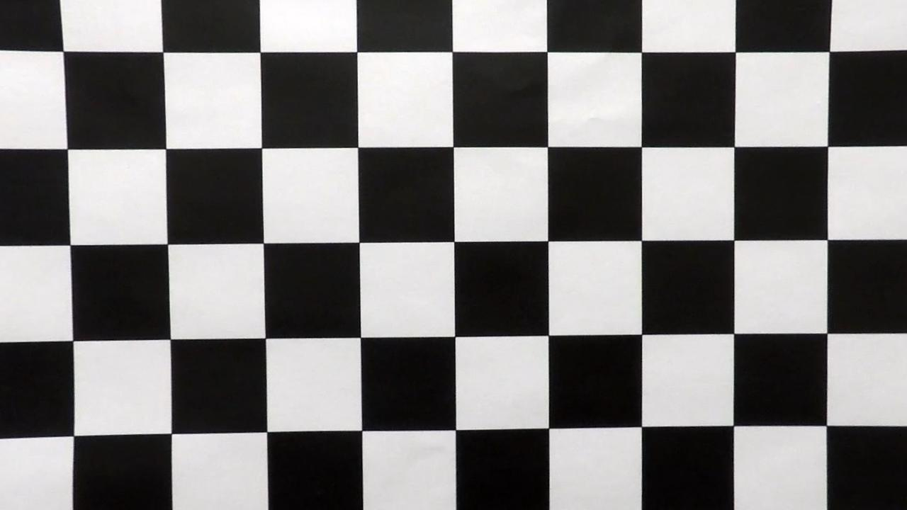
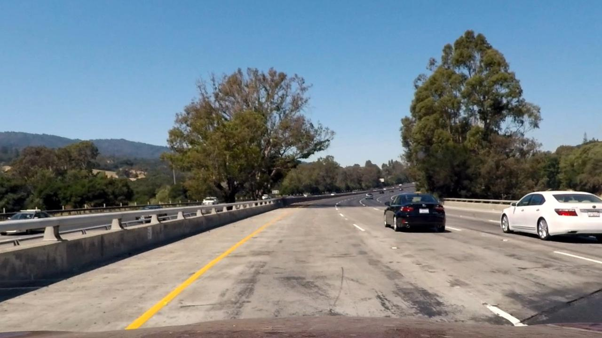
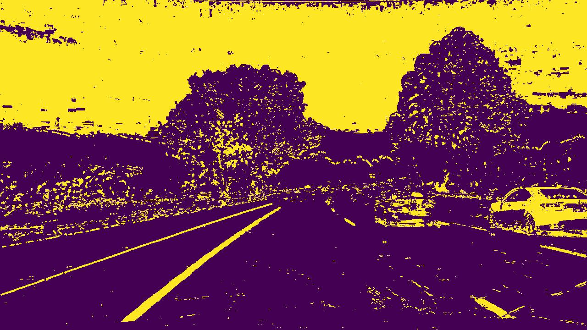
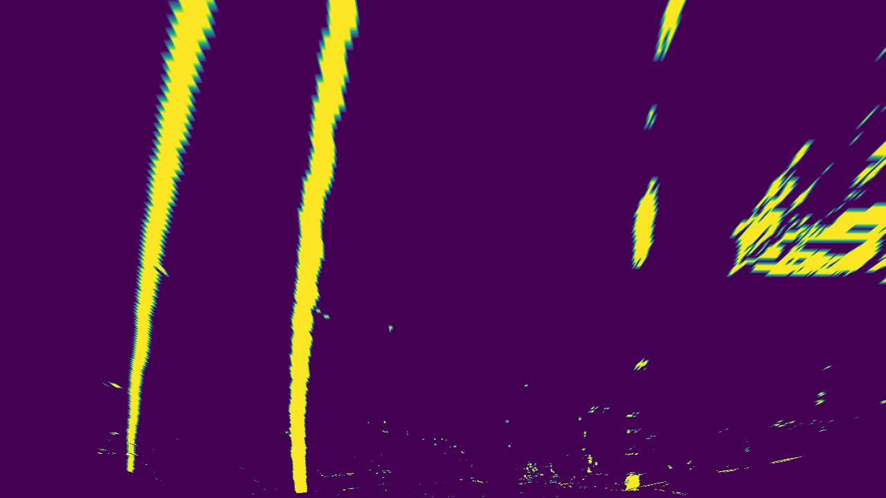
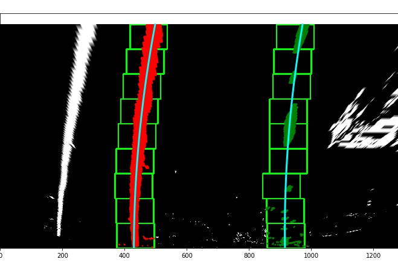
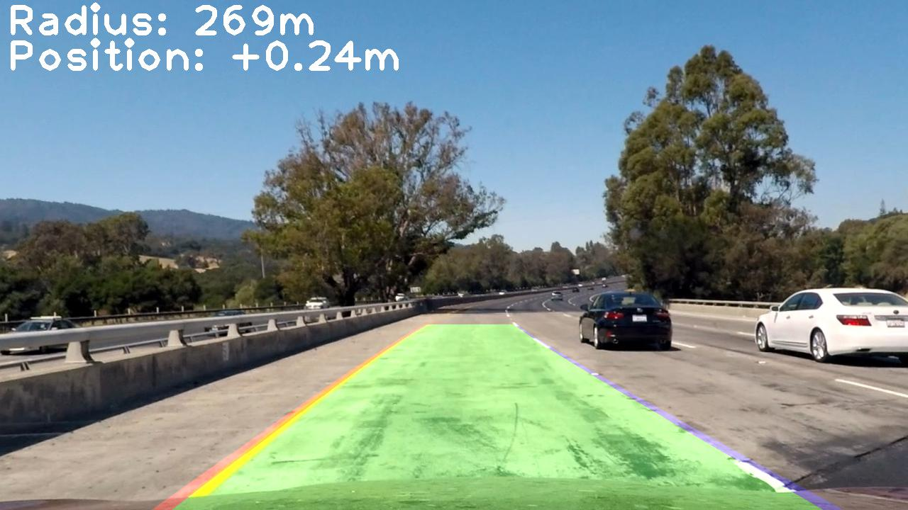

Advanced Lane Finding Project
===

The goals / steps of this project are the following:

* Compute the camera calibration matrix and distortion coefficients given a set of chessboard images.
* Apply a distortion correction to raw images.
* Use color transforms, gradients, etc., to create a thresholded binary image.
* Apply a perspective transform to rectify binary image ("birds-eye view").
* Detect lane pixels and fit to find the lane boundary.
* Determine the curvature of the lane and vehicle position with respect to center.
* Warp the detected lane boundaries back onto the original image.
* Output visual display of the lane boundaries and numerical estimation of lane curvature and vehicle position.

## Preamble

This project follows the following structure:

* [pipeline.py](./pipeline.py): includes helper functions and classes for the application pipeline.
* [demo.ipynb](./demo.ipynb): includes the actual pipeline application code and the main parameters for the application.
* [output_images](./output_images): includes generated images by the application
* [output_videos](./output_videos): includes generated videos by the application
* [data](./data): includes input images and videos data

### For development

Here are some files for the development:

* [config](./config): config files
* [tool](./tool): utility tools
* [template](./template): includes example images and source code provided by Udacity

## [Rubric](https://review.udacity.com/#!/rubrics/571/view) Points

* Here I will consider the rubric points individually and describe how I addressed each point in my implementation.

---

### Writeup / README

#### 1. Provide a Writeup / README that includes all the rubric points and how you addressed each one.  You can submit your writeup as markdown or pdf.  [Here](https://github.com/udacity/CarND-Advanced-Lane-Lines/blob/master/writeup_template.md) is a template writeup for this project you can use as a guide and a starting point.

You're reading it!

### Camera Calibration

#### 1. Briefly state how you computed the camera matrix and distortion coefficients. Provide an example of a distortion corrected calibration image.

The functions for calibrating camera and undistorting image are packed in `Undistorter` class, which is located between line 38 and line 71 of `pipeline.py`.
Furthermore, the actual application of `Undistorter` is located in the the 1st and 2nd code cells of `demo.ipynb`.

The constructor of `Undistorter` takes 2 arguments, chessboard images for calibration and chessboard grid size of target images.
I start by preparing "object points", which will be the (x, y, z) coordinates of the chessboard corners in the world.
Here I am assuming the chessboard is fixed on the (x, y) plane at z=0, such that the object points are the same for each calibration image.
Thus, `objp` is just a replicated array of coordinates, and `objpoints` will be appended with a copy of it every time I successfully detect all chessboard corners in a test image.
`imgpoints` will be appended with the (x, y) pixel position of each of the corners in the image plane with each successful chessboard detection.

I then used the output `objpoints` and `imgpoints` to compute the camera calibration and distortion coefficients using the `cv2.calibrateCamera()` function.  I applied this distortion correction to the test image using the `cv2.undistort()` function and obtained this result:

### Pipeline (single images)

#### 1. Provide an example of a distortion-corrected image.

For distortion correction of each image, I simply use `Undistorter.apply()`.
Here's an example of undistorted image.

#### 2. Describe how (and identify where in your code) you used color transforms, gradients or other methods to create a thresholded binary image.  Provide an example of a binary image result.

I used a combination of saturation and gradient thresholds (`cv2.Sobel()`) to generate a binary image.
The thresholding function is packed in `LaneFeatureExtractor` class, which is located at lines 75 through 185 in `pipeline.py`.
The application of this class is located in the 3rd cell of `demo.ipynb`.
We can tune the paramters (the kernel sizes of each sobel filter and the thresholds of each filter) by passing to the constructor of `LaneFeatureExtractor`.

The output binary image is composed by the union of the following three filtered images.
1. the intersect of x/y absolute sobel filtering
2. the intersect of magnitude and direction of sobel filtering
3. saturation

Here's an example of my output of applying `LaneFeatureExtractor.extract()` to an image.

#### 3. Describe how (and identify where in your code) you performed a perspective transform and provide an example of a transformed image.

The code for my perspective transform packed in `Warper` class, which appears in lines 188 through 230 in the file `pipeline.py`.
The application of `Warper` is located in the 4th cell of `demo.ipynb`.
The constructor of `Warper` class takes the `src` and `dst` pair of points for perspective transform.
I assume the `src` points forms a trapezoid and the `dst` points forms a rectangular, so the constructor only takes `upper_left_point_pair` and `lower_left_point_pair`.

This resulted in the following source and destination points:

| Source        | Destination   |
|:-------------:|:-------------:|
| 526, 470      | 300, 200      |
| 0, 719        | 300, 719      |
| 1219, 719     | 919, 719      |
| 754, 470      | 919, 200      |

I verified that my perspective transform was working as expected by drawing the `src` and `dst` points onto a test image and its warped counterpart to verify that the lines appear parallel in the warped image.

`Wraper` has two types of warp function, `forward_warp()` and `inverse_warp()`.
`forward_warp()` does the perspective transform from `src` to `dst`, whereas `inverse_warp()` does from `dst` to `src`.

Here's an example of warped image.

#### 4. Describe how (and identify where in your code) you identified lane-line pixels and fit their positions with a polynomial?

`LaneDetector` class is for lane detection, line fitting, curvature and car position calculation, which is located in lines 243 through the end of `pipeline.py`.
The application of class is located in the 5th cell of `demo.ipynb`.

The detection stage is located in lines 307 through lines 432 of `pipeline.py`.
I use bounding boxes to search lane-line pixels for left line and right line respectively.
Searching starts from the bottom of image.
The initial x position of the box is the argmax of histogram, and
the x position of the box will shift based on detected pixels.
The line fitting is done by `np.fitpoly()` with detected point pixels.
I use quadratic functions for fitting function.

Here's an example of the detection stage:

#### 5. Describe how (and identify where in your code) you calculated the radius of curvature of the lane and the position of the vehicle with respect to center.

This is in lines 434 through 461 in my code in `pipeline.py`.
For obtaining curvature radius and car offset by meters, I scale coefficients of the fitted function.
With the fitted function of left line is denoted as $ x = a y^2 + b y + c $, I use the following formula for calculating curvature radius $R$:

$$ A = \frac{S_x}{S_y^2} a, \quad B = \frac{S_x}{S_y} b, \quad C = c $$
$$ R = \frac{\left\{1 + \left(2 A S_y y + B\right)^2\right\}^\frac{3}{2}}{2 |A|} $$

$S_x$ denotes the scale of x (`x_m_per_px`), $S_y$ denotes the scale of y (`y_m_per_px`).
For $y$, I chose the bottom of image (`height - 1`).

Next, the car offset from the center is calculated as follows:

$$ \frac{(a_l y^2 + b_l + c_l) + (a_r y^2 + b_r + c_r)}{2} - x_\mathrm{center} $$

$a_l, b_l, c_l$ are the coefficients of the fitted function of left lane, $a_r, b_r, c_r$ are the coefficients of the fitted function of right lane.
I chose the middle of image as $x_\mathrm{center}$ (`width//2`) and the bottom of image as $y$ (`height - 1`).

#### 6. Provide an example image of your result plotted back down onto the road such that the lane area is identified clearly.

I implemented this step in lines 463 through 516 in my code in `pipeline.py`.
First I used `cv2.polylines()` to draw lane line and `cv2.fillPoly()` to draw lane area (implemented in `create_lane_image()` function).
Then I warped the generated birdview image to the same perspective to the raw image by `Warper.inverse_warp()`, and mixed the raw image and the generated image (implemented in `mix_image()`).
After that, I embedded the curvature radius and the car position offset information to the result image (implemented in `embed_status()`).
In Position status, plus (`+`) denotes off to the right, and minus `-` denotes off to the left.
Here's an example of my result on a test image:

---

### Pipeline (video)

#### 1. Provide a link to your final video output.  Your pipeline should perform reasonably well on the entire project video (wobbly lines are ok but no catastrophic failures that would cause the car to drive off the road!).

Here's a [link to my video result](./output_videos/project_video.mp4).

For stream pipelining, I used the previous lane detection information to search current lane line.
That is, I search around the fitted functions of previous lane line instead of using bounding boxes.

Furthermore, I averaged the coefficients of the recent fitted functions for smoothing.

---

### Discussion

#### 1. Briefly discuss any problems / issues you faced in your implementation of this project.  Where will your pipeline likely fail?  What could you do to make it more robust?

Here I'll talk about the approach I took, what techniques I used, what worked and why, where the pipeline might fail and how I might improve it if I were going to pursue this project further.

Each stage of the pipeline is based on the code in the lesson, but I turned them into class interface for the reusing convenience.

I think the pipeline may fail with the image with many noises.
The robust regression algorithm for fitting could be used for robust detection against these noises.

